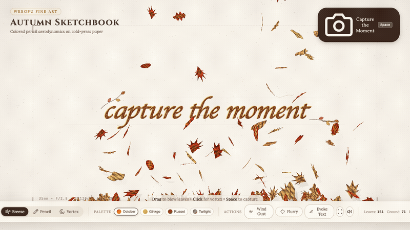
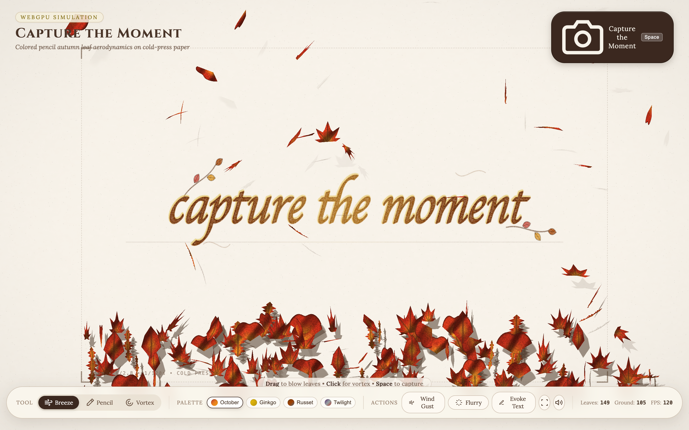
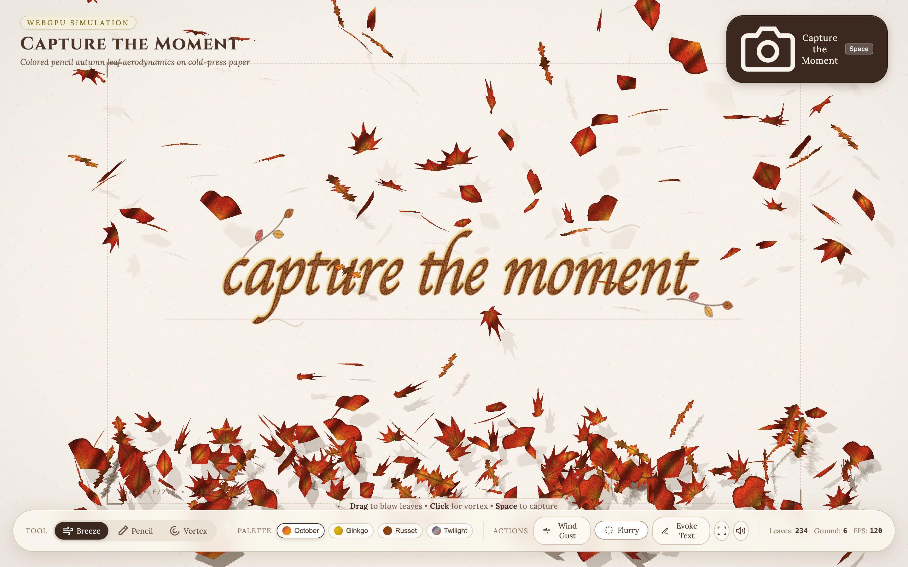
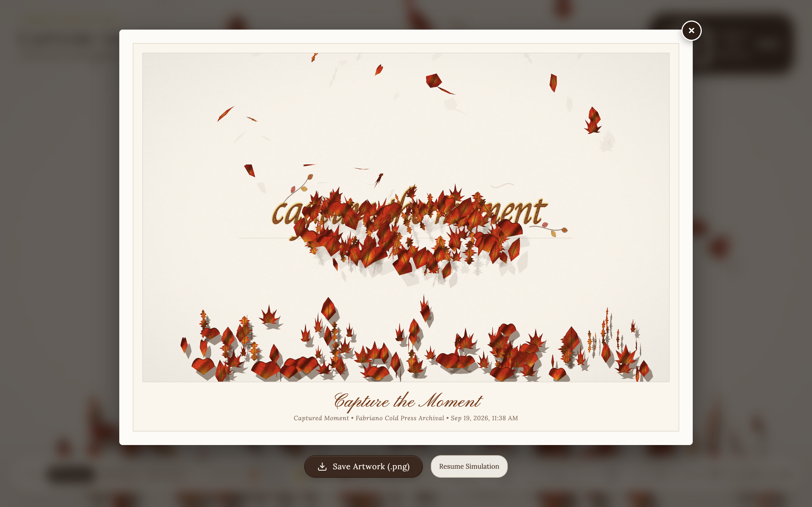

# Capture the Moment



A real-time WebGPU simulation of colored pencil autumn leaves tumbling, fluttering, and settling onto archival cold-press paper — with the calligraphic inscription *"capture the moment"* etched into the paper grain.

## Quick Start

Node.js 18+ required.

```bash
git clone https://github.com/andrewvoirol/capture-the-moment.git
cd capture-the-moment
npm install
npm run dev
```

Open `http://localhost:5173` in any browser with WebGPU enabled (Chrome 113+, Chrome Dev, Edge, Safari 18+).

---

## How It Works

1. **Stir the Leaves**: Drag anywhere across the canvas with the **Breeze** tool to blow leaves in flight and rustle settled ground leaves. Switch to **Vortex** to kick leaves up into an autumn whirlwind.
2. **Sketch with Colored Pencil**: Select the **Pencil** tool and draw directly onto the paper. Strokes catch on the procedural paper tooth and reflect colored wax pigment matching your active autumn palette. Press `C` to clear pencil marks.
3. **Evoke the Inscription**: Click **Evoke Text** (or press `M`) to watch the autumn breeze catch airborne leaves and guide them into the cursive letters of *"capture the moment"* before drifting down.
4. **Capture the Moment**: Press `Spacebar` or click **Capture the Moment** to trigger a mechanical shutter flash and sound, freezing the instant into a framed exhibition sketch that you can save as a high-resolution PNG.

### The Technical Craft

The engine runs a multi-pass WebGPU pipeline with zero dynamic allocations inside the frame loop. Procedural Fabriano cold-press paper is generated on the GPU using layered Simplex noise, microscopic cellulose fiber strands, and normal perturbations. Falling leaves simulate non-linear Zhukovsky aerodynamic flutter (side-to-side gliding lift, pitch autorotation, and curl turbulence) across five botanically modeled species (Japanese Maple, Sugar Maple, White Oak, Ginkgo Biloba, and Birch). The colored pencil shader evaluates directional cross-hatching, stochastic tooth-peak pigment catch, 3-stage colored wax layering (undertone, midtone, deep shadow), hand-sketched 2B pencil contour lines, and soft graphite cast shadows that sharpen into contact shadows upon ground settlement.

---

## States

### Canvas View & Aerodynamic Flutter


### Canopy Flurry & Mid-Air Drift


### The Captured Moment (Framed Artwork Modal)


---

## Tech Stack

| Layer | Technology |
|---|---|
| Graphics API | WebGPU (WGSL compute & render pipelines) |
| Core Language | TypeScript 5.4 |
| Bundler & Dev Server | Vite 5.2 |
| Substrate Shader | Procedural Fabriano paper fibers & tooth relief |
| Leaf Shading | Multi-pass colored pencil cross-hatch & wax bloom model |
| Audio Engine | Web Audio API (procedural shutter snap & leaf rustle) |
| Verification | Playwright + Chromium Metal WebGPU harness |
